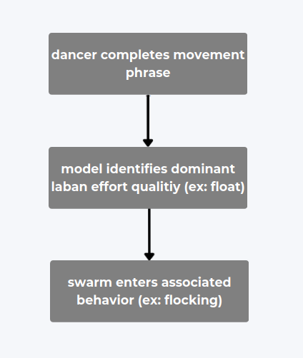

## Project Description and Performance Vision 
This project translates human expression into robotic collective behavior. A solo dancer performs an improvisational phrase, which is analyzed in real time and categorized using a simplified Laban Movement Analysis (LMA) supervised machine learning model. These movement states are then mapped to distinct swarm behaviors executed by a group of TurtleBot3 robots.

The system is built on ROS 2 and leverages the ros2swarm library to enable decentralized multi-robot coordination. Each identified Laban category activates a corresponding swarm algorithm—ranging from smooth, cohesive flocking patterns to sharp, dispersive group motions—allowing the robot swarm to respond not by mimicking, but by embodying the expressive tone of the dancer’s movement in space.

## System Flow Diagram

  

---

### Early Inspiration
- [“Drift” by Murmuring Minds at LUMA Arles 2024](https://www.designboom.com/art/drift-choice-swarm-inspired-murmuring-minds-luma-arles-09-05-2024/?utm_source=chatgpt.com)

## Technical Goals

### Fallback Goal 
- Reproduce the paper ["AI-Driven Human Motion Classification and Analysis Using Laban Movement System"](https://research.dwi.ufl.edu/page/ai-driven-human-motion-classification-and-analysis-using-laban-movement-system/) and implement a working classifier that distinguishes basic effort qualities.

### Core Goal
- Associate real-time ML effort classification with TurtleBot3 swarm behaviors using the `ros2swarm` library.
- **Need to decide between opti-trak or lidar**

### Stretch Goal
- Enable portable, site-independent performance using only onboard sensing (LiDAR-based tracking).
- Deploy system in live, flexible environments without external motion capture.

---

## Learning Objectives

1. Reproduce and build upon Laban-based movement classification techniques.
2. Develop fluency in ROS 2 and multi-robot coordination.
3. Investigate how robotic swarms can embody expressive qualities rather than mimic motion directly.

---

## Process Part 1: Movement Analysis

1. Break down and reproduce methods from the UF Laban ML paper.
2. Gather annotated motion data (or request access to original labeled samples).
3. Rebuild classifier architecture, focusing specifically on **Effort** qualities (e.g., weight, time, flow).
4. Evaluate classifiers using accuracy, F1 score, and confusion matrices.

---

## Process Part 2: Swarm Motion

- Explore multi-robot choreography using TurtleBot3 platforms and the `ros2swarm` package.

- Implement and test swarm patterns aligned with Effort qualities:
  - e.g., “float” → flocking, “punch” → scattering
- Evaluate mapping between expressive states and robotic motion.

> Reference: [`swarmROS2`](https://arxiv.org/pdf/2405.02438) — A ROS 2-based library of swarm motion behaviors using LiDAR-only localization.

---
